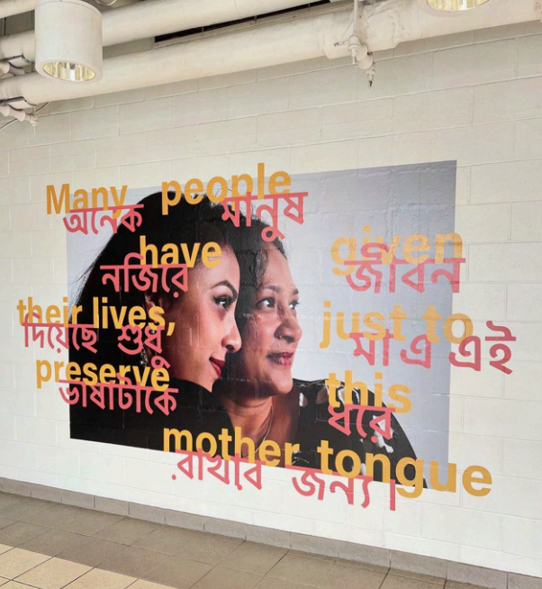
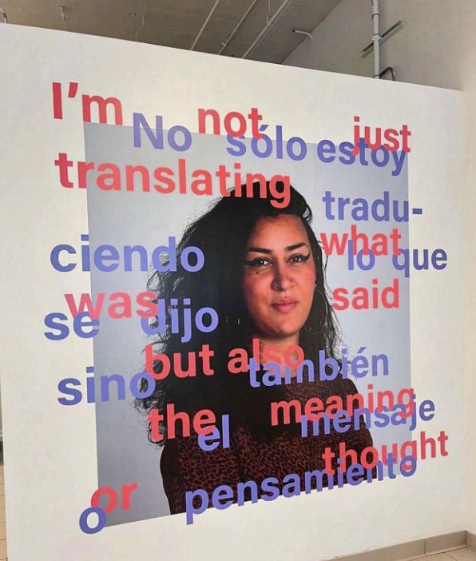

## Overview

Through the [Lives in Translation](https://sasn.rutgers.edu/lives-translation) (LiT) program, I coordinate community-based initiatives centered on critical civil engagement, connecting academic learning with real-world community needs.

## Featured Projects

### A Feeling Of Itself Exhibition

Lives in Translation, in collaboration with the Design Consortium at RU-N, presents *A Feeling Of Itself*, an exhibition that engages the audience through a set of multimedia audio-visual experiences that express the value of living in translation. The exhibition was based on cultural exchange and the concept of what in Spanish we call "arraigo," which roughly translates to "a sense of belonging because of one's roots." The title, *A Feeling Of Itself*, is a phrase from one of the recordings — the brother of an LiT student sharing his unique story of life between languages, and the feeling of expressing and communicating in two or more languages at once.

The ongoing project aims to inspire students to contribute their unique voices, highlighting translation as a powerful conduit for cultural exchange and effective communication.

The current phase of *A Feeling Of Itself* is presented in collaboration with Project for Empty Space at 800 Broad Street, Newark, NJ. 

The three-part program commenced in March 2026, with the A Feeling of Itself Window Installation at 19 Williams Street in Newark, presented in partnership with Teachers Village and RBH Group. The second phase, on view March 24 through June 1, 2026, expands into a full exhibition at Project for Empty Space, 800 Broad Street, Newark, and will open with a reception on April 2 from 6–8 pm. The project will culminate in a site-specific lighting installation across the exterior façade of Edison Place, transforming the building into a beacon that connects language and light.

Alongside the exhibition, a series of programs exploring language, culture, technology, and community will take place at 800 Broad Street, Newark. These programs include conversations, interactive experiences, and opportunities for participation by all ages.

Over the next two months, we are excited to welcome Sarita Monjane Henriksen, Fullbright Scholar-in-Residence at Rutgers-Newark, Ross Perlin, Linguist and Co-Director of the Endangered Language Alliance, Tareq Baconi, writer, scholar, and activist, and Para KIDS! as programming partners. Each gathering will feature catering from local cultural food vendors, and the series will culminate in a permanent lighting installation on the side of Project for Empty Space that will continue to engage the community beyond the program’s conclusion.

To learn more, check out the exhibition webpage: (https://www.projectforemptyspace.org/afeelingofitself)

::: {layout-ncol=2}

:::

### Decolonizing Translation in the U.S./Mexico Diaspora

In January 2025, as part of a Lives in Translation and Center for Politics and Race in America collaboration, *Decolonizing Translation in the U.S./Mexico Diaspora*, with Professors Janice Gallagher, we accompanied eight students to Mexican Indigenous communities. There, students collaborated with grassroots organizations, documented community-led efforts to preserve language and culture, and provided translation and interpreting services.

This project was funded by the CPRA Faculty Research Grant.

**Project Video: Decolonizing Translation in the U.S./Mexico Diaspora Tejiendo Puentes / Weaving Bridges**

<iframe width="560" height="315" src="https://www.youtube.com/embed/3M9mbtGamEs" title="Decolonizing Translation in the U.S./Mexico Diaspora Tejiendo Puentes / Weaving Bridges" frameborder="0" allow="accelerometer; autoplay; clipboard-write; encrypted-media; gyroscope; picture-in-picture; web-share" allowfullscreen></iframe>

---

*To learn more about community engagement opportunities or partnerships, please [contact me](mailto:stephanie.rodrig@rutgers.edu).*